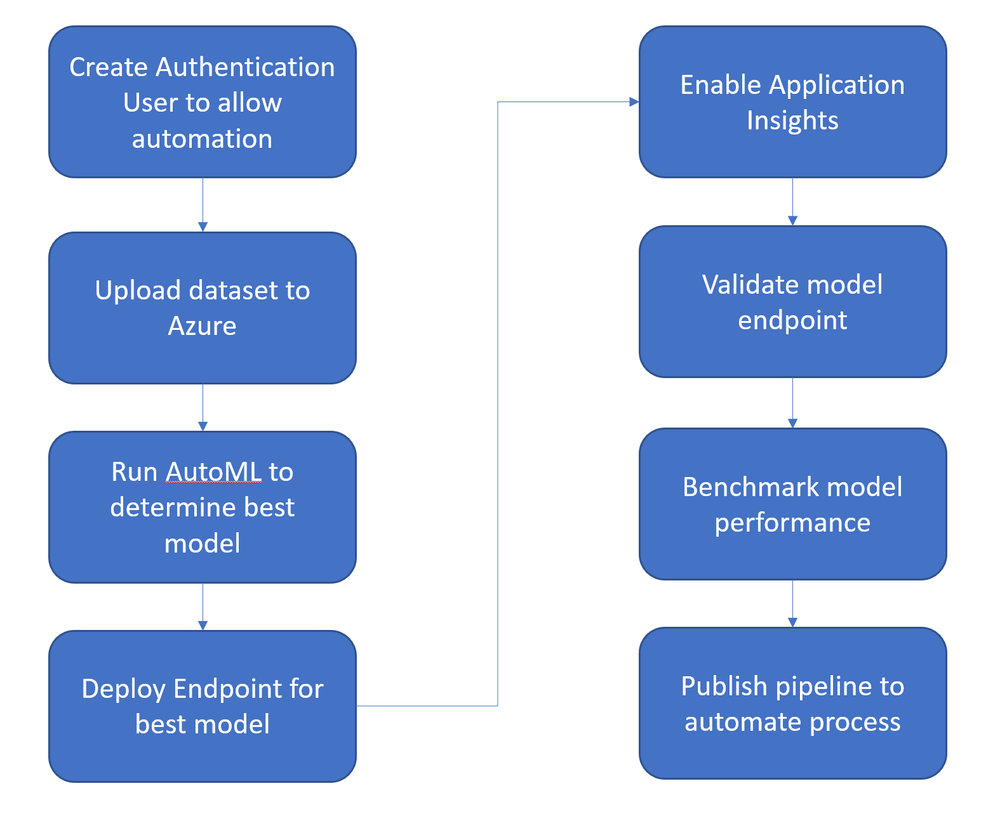
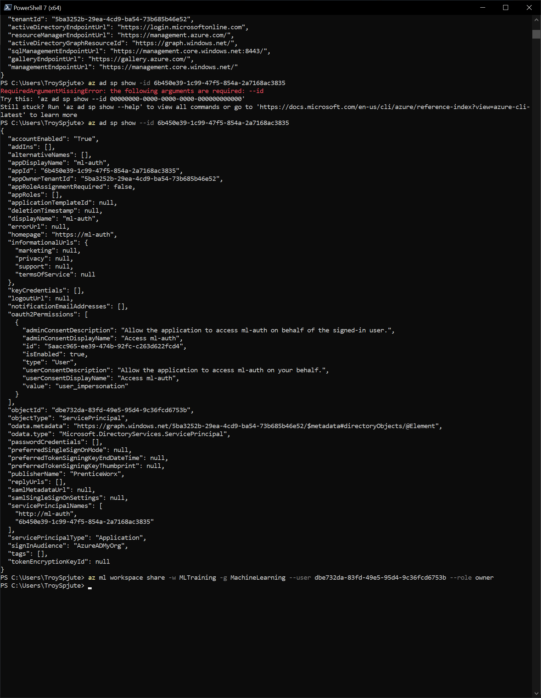

## Automated Machine Learning with Model Deployment

This project is an example of how I am able to take an input dataset and create a fully functional machine learning model that can predict future success that is accessible via an http endpoint.  This specific model highlights a bank marketing dataset and tries to predict whether the potential client will use the bank's services based on training data from past experience.  The project began with just a standard csv file, and used Automated Machine Learning (AutoML) a fairly accurate model was derived using DevOps techniques from a Python script that can be duplicated for other datasets with little effort.  The model is then published to Azure as an endpoint that can be used from an service that can generate an http request.  I also used Apache Benchmark to load test the endpoint.

## Architectural Diagram

## Key Steps
*TODO*: Write a short discription of the key steps. Remeber to include all the screenshots required to demonstrate key steps. 
The first step is to set up a method of authentication to use for the scripts so that the automation can run without user intervention.

Once everything is set up the data needs to be uploaded and registered in Azure.  A profile may also be generated to help identify possible areas of improvement.

The dataset can be uploaded as part of the initial Automated ML run, or chosen later.  
Once the initial run has been completed, the run can be automated using the Python SDK
The scripts can be configured to show the run details.

The experiment and pipeline will be shown in Azure ML Studio

Automated ML will give the best model based on the settings chosen

After the best model is obtained, it needs to be published.

The published model can then have logs saved to Application Insights.  The logs can be access either programmatically or through Azure.

The model can then be run by hitting an http endpoint whenever needed to get an estimate.

## Screen Recording
https://youtu.be/IBKF7ZX60Rw

## Standout Suggestions
I ran the processes locally using a personal Azure workspace to make sure that I could set up an entire environment and understand the dependencies involved.  I also installed and used Apache Benchmark to load test the resulting endpoint, which can give key metrics as to the health and viability of a model.

## Ideas for Improvement
Using a larger dataset and turning on Deep Learning could give a better model result.  Additional model steps could be added to parallelize model preparation if there were other steps that needed to be taken to process the data, especially if there was more data.